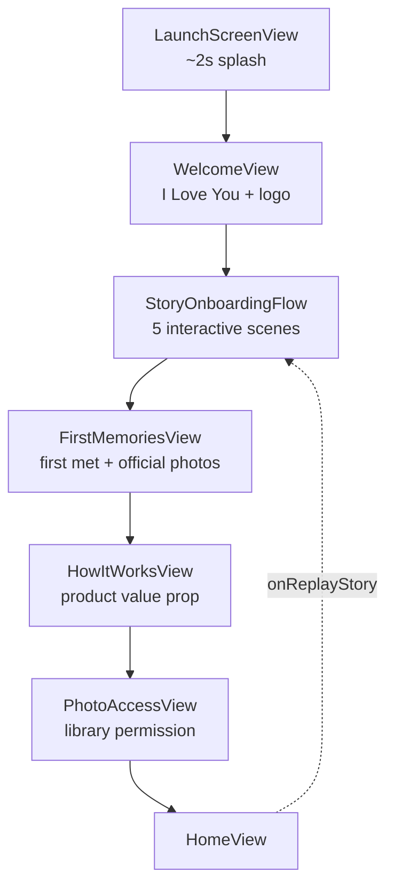
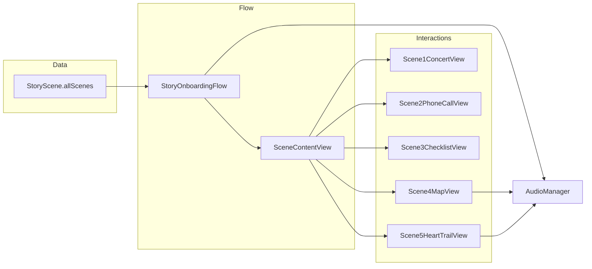
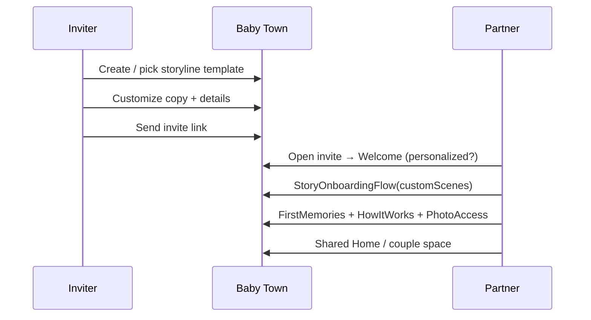

# Baby Town — Onboarding Design

This document describes how onboarding works today: a **personal, interactive love story** (custom-built for Trish & Yoobin) followed by **product onboarding** that seeds the couple’s private space in the app. It is written to support a future feature where invitees get their **own** storyline—built from templates or creator-defined scenes—before the shared system flow.

---

## Goals

| Phase | Purpose |
|-------|---------|
| **Story onboarding** | Emotional hook: retell *how we met* through touch, sound, and motion—not a generic tutorial. |
| **System onboarding** | Practical setup: anchor memories, explain the product, request photo access, land on Home. |

Together, first launch feels like: *our story → our photos → how Baby Town works → start using the app*.

---

## End-to-end flow

Navigation is owned by `ContentView` as a screen enum. New users always see the launch splash, then walk forward; returning users skip to Home (or last screen) when `hasCompletedOnboarding` is true.



**Persistence**

- `hasCompletedOnboarding` is set to `true` only after **PhotoAccessView** completes (`DataPersistenceManager`).
- **FirstMemoriesView** already creates pinned/unpinned `Moment` rows (“When we first met”, “When we became official”) before onboarding is marked complete.
- Users who finished onboarding can replay the story from Home via `onReplayStory` without re-running system steps.

**Key files**

| Screen | File |
|--------|------|
| Orchestration | `BabyTown/ContentView.swift` |
| Custom story | `BabyTown/Views/StoryOnboardingFlow.swift` |
| Scene data | `BabyTown/Models/StoryScene.swift` |
| Scene UIs | `BabyTown/Components/Scene1ConcertView.swift` … `Scene5HeartTrailView.swift` |
| Audio | `BabyTown/Services/AudioManager.swift` |
| Story chrome | `BabyTown/Components/StoryOnboardingTheme.swift`, `HeartProgressIndicator.swift`, `PrimaryCTAButton.swift` |

---

## Phase 1 — Welcome & story framing

### WelcomeView

- Brand moment: Baby Town logo, “First Page Cat” art, **“I Love You”**, floating hearts.
- Single CTA: **“Continue to Baby Town”** → enters story onboarding.
- No data collected; sets tone before the personal narrative.

---

## Phase 2 — Custom story onboarding (`StoryOnboardingFlow`)

### Concept

Five **scenes** form a linear **storyline**. Each scene has:

1. **Title / subtitle** (date & place where relevant)
2. **Interaction** (mini-game tied to a moment in the real story)
3. **Story text** (one or two sentences of narrative)
4. **Primary CTA** (advances when rules allow)

Progress is shown with **five hearts** (`HeartProgressIndicator`). Scenes live in a horizontal `TabView` (page style); users may swipe **back** freely, but **cannot swipe forward** until the current scene is marked complete (`completedScenes`).

### Real-world narrative (Yoobin & Trish)

This is the story encoded in `StoryScene.allScenes` today—not configurable in-app yet.

| # | Title | What happened | Interaction metaphor |
|---|--------|----------------|----------------------|
| 1 | Oct 28, 2023 | Met at Chainsmokers, Shoreline Amphitheatre, Mountain View | Concert / music / lights |
| 2 | The Unexpected Call | Trish stranded on highway; called someone she’d never met | Incoming phone call |
| 3 | Knight in Pajamas | Yoobin jumped up, grabbed gear, rushed out | Night checklist (keys, tools, wallet) |
| 4 | Daddy Rescue | Her dad was closer; got her safe first | Drive / navigate to safety |
| 5 | The Best Night | First in-person night in Mountain View | Color in a heart → “save our memories” |

Scene 5’s CTA (**“Save our memories”**) is the narrative bridge into **FirstMemoriesView** (actually picking photos).

### Scene-by-scene behavior

#### Scene 1 — Concert lights (`concertLight`)

- **View:** `Scene1ConcertView` — music-note orb, idle float animation.
- **CTA flow (two taps):**
  1. First tap: label **“Concert Lights”** → sets `scene1AnimationTriggered`, plays **concert music** (`AudioManager.playConcertMusic()` — Chainsmokers “Closer” or `concert_lights.mp3`), triggers rave lights, sparkles, floating note symbols.
  2. Second tap: **“Next”** → stops music, advances.
- **Note:** Scene 1’s bottom CTA is always enabled; other scenes require `interactionComplete`.

#### Scene 2 — The unexpected call (`phoneCall`)

- **View:** `Scene2PhoneCallView` — pulsing green call button, phone wiggle.
- **Audio:** Ringtone loops when user **arrives** on scene (index 1); stops on leave or when CTA **“Answer the call”** fires.
- **Completion:** `isInteractionComplete = true` on appear (user only needs to tap CTA to advance).

#### Scene 3 — Knight in pajamas (`checklist`)

- **View:** `Scene3ChecklistView` — moon/stars card; three tappable rows:
  - G35 Keys
  - Tools
  - Wallet  
  (A fourth “BJ” row exists in comments but is hidden.)
- **Audio:** Footsteps loop while on this scene.
- **Completion:** All three items checked (heart checkboxes). CTA: **“Ride into the night”**.

#### Scene 4 — Daddy rescue (`mapNavigate`)

- **View:** `Scene4MapView` — stylized path, car icon, **Navigate** button.
- **Interaction:** Tap Navigate → car door + engine SFX, 2s path animation, safe-zone shield appears.
- **Completion:** After animation. CTA: **“We’re safe”**.

#### Scene 5 — The best night (`heartTrail`)

- **View:** `Scene5HeartTrailView` — drag to “shade” a large heart; fill mask rises with finger movement.
- **Completion:** Fill ≥ 99% → pulse, sparkles, floating hearts, **yipee** SFX (`playYipee()`). Scroll disabled on this scene.
- **CTA:** **“Save our memories”** → `onFinishedStory()` → `FirstMemoriesView`.

### Audio map (story phase only)

| Scene | Trigger | Asset / behavior |
|-------|---------|------------------|
| 1 | CTA “Concert Lights” | Concert track, loops until leave scene 1 |
| 2 | Enter scene | `ringtone.mp3`, loops |
| 2 | CTA / leave | Stop ringtone |
| 3 | Enter scene | Footsteps loop |
| 3 | CTA / leave | Stop footsteps |
| 4 | Navigate tap | Car door → engine (sequential) |
| 5 | Heart complete | One-shot yipee |

### Data model (today)

```swift
struct StoryScene {
    let id: Int
    let title: String
    let subtitle: String?
    let storyText: String
    let ctaText: String
    let interactionType: InteractionType
}

enum InteractionType {
    case concertLight
    case phoneCall
    case checklist
    case mapNavigate
    case heartTrail
}
```

Scenes are **hard-coded** in `StoryScene.allScenes`. The `interactionType` enum drives which SwiftUI component renders in `SceneContentView`.

### UX rules (story shell)

- Forward swipe blocked until current index is in `completedScenes`.
- `interactiveDismissDisabled()` on the flow (no accidental dismiss).
- Blush background + red/pink theme via `StoryOnboardingTheme`.
- Bottom **PrimaryCTAButton** is the main advance control; scene-specific buttons (e.g. Navigate) also gate completion.

---

## Phase 3 — System onboarding (product & private space)

After the story, screens use the **default Baby Town** visual language (white/pink gradients, serif titles)—not `StoryOnboardingTheme`.

### FirstMemoriesView

- **Ask:** Pick photos for **“When we first met”** (optional) and **“When we became official”** (required).
- **On Done:** `ContentView` builds up to four `Moment` entries (pinned + unpinned for each prompt) and passes images/dates into `HomeViewModel`.
- This is the first **real user content** in the timeline—not just animation.

### HowItWorksView

- Explains core value: pick photos → Baby Town groups by day/place, throwbacks improve over time.
- Benefits: calendar grouping, places, sparkles/throwbacks.
- CTA: **“Enter Baby Town”** → PhotoAccessView.

### PhotoAccessView

- Explains full vs limited library access.
- Triggers `PHPhotoLibrary.requestAuthorization` (read/write or add-only).
- **On continue:** `setOnboardingCompleted(true)` → **Home**.

### HomeView (post-onboarding)

- Normal app usage; optional **replay story** without resetting onboarding flag.

---

## Architecture diagram (story subsystem)



---

## Future: custom storylines for partner invites

**Vision (not built yet):** When User A invites Partner B, B sees a **creator-defined or template-based** story—same *shape* as today’s flow (sequential scenes + interactions + audio), then the **same system onboarding** (memories, how it works, photos, home).

### What should become configurable

| Layer | Today | Target |
|-------|--------|--------|
| Copy | Fixed strings in `StoryScene` | Per-invite or per-template: titles, subtitles, body, CTA labels |
| Scene count | 5 | Variable (e.g. 3–7), still with heart progress |
| Interaction | 5 Swift enums | **Interaction templates** reused across stories |
| Audio | Bundled MP3s keyed in code | Optional per-scene sound IDs or URLs |
| Media | SF Symbols + generative UI | Optional hero images per scene |
| Personal facts | Concert date, checklist items | Creator form: date, place, item labels |
| Branching | Linear only | Optional later; v1 can stay linear |

### Interaction templates (building blocks)

These map 1:1 to existing components—good candidates for a **scenario library**:

| Template ID | User-facing idea | Current implementation | Typical story use |
|-------------|------------------|------------------------|-----------------|
| `concertLight` | Music / celebration / first meeting | Rave lights + music | Concert, festival, party |
| `phoneCall` | Urgent connection / surprise call | Ringing phone | Breakdown, late-night call, long distance |
| `checklist` | Rush out the door / prepare | Check items | Trip, rescue, moving in |
| `mapNavigate` | Journey / drive / arrival | Path + car | Road trip, picking them up, moving cities |
| `heartTrail` | Emotional climax / commitment | Draw-to-fill heart | First date, proposal, “we’re official” |

Additional templates (future) might include: photo reveal, tap-to-reveal letter, countdown date, dual-checkbox (“both said yes”), etc.—implemented as new `InteractionType` cases + views.

### Scenario packs (product direction)

Pre-authored **story packs** help couples who do not want to design from scratch:

| Pack name (example) | Scene outline | Templates used |
|---------------------|---------------|----------------|
| **Concert meet-cute** | Venue night → text/call → first hangout → heart | concert → phone → map → heart |
| **Coffee shop** | First sight → spilled drink → walk home → heart | checklist variant → map → heart |
| **Long distance** | Video call → flight → reunion → heart | phone → map → heart |
| **Office / school** | Same class → study night → official → heart | checklist → phone → heart |
| **Custom** | User orders scenes from template picker | Any |

Your personal story is effectively the **“Concert + rescue + first night”** pack—the reference implementation.

### Suggested data shape (future)

Keep separation between **story config** (JSON / Firestore / invite payload) and **views** (Swift templates):

```json
{
  "storylineId": "concert-rescue-v1",
  "creatorDisplayName": "Yoobin",
  "scenes": [
    {
      "title": "Oct 28, 2023",
      "subtitle": "Shoreline Amphitheatre, Mountain View",
      "storyText": "...",
      "ctaText": "Concert Lights",
      "interaction": "concertLight",
      "audio": { "onEnter": null, "onAction": "concert_closer" }
    }
  ],
  "afterStory": "default_system_onboarding"
}
```

Runtime: decode → `[StoryScene]` → existing `StoryOnboardingFlow` with injected scene array.

### Partner invite flow (conceptual)



Open product questions for a later spec:

- Does B see A’s story verbatim, or a **paired** story (two perspectives)?
- Is storyline creation **before** invite send, or co-edited after B joins?
- Replay: per-user story vs shared canonical story on the couple profile?

### Implementation phases (recommended)

1. **Extract config** — Move `StoryScene.allScenes` to JSON bundled as `default_story_yoobin_trish.json`; load at runtime; no UI change.
2. **Template metadata** — Document each `InteractionType` with required fields (e.g. checklist: `items[]` with `icon`, `label`).
3. **Creator UI (inviter)** — Pick pack → edit text → preview → attach to invite.
4. **Invite payload** — Deep link passes `storylineId` or inline JSON; B’s app hydrates `StoryOnboardingFlow`.
5. **Scenario library** — Ship 3–5 packs; analytics on which packs complete vs drop off.
6. **Optional branching / media** — Only if packs prove insufficient.

### What not to duplicate

System onboarding (**FirstMemories → HowItWorks → PhotoAccess → Home**) should stay **one shared path** for all users. Only the **prequel story** is custom per couple or per invite.

---

## Testing & replay

- **SwiftUI previews** exist per scene in `StoryOnboardingFlow.swift`.
- **Reset app** from Home clears persistence and returns to `WelcomeView`.
- **Replay story** from Home jumps to `storyOnboarding` only; does not clear moments or onboarding flag.

---

## Summary

| Segment | Duration (feel) | Custom? |
|---------|-----------------|--------|
| Launch + Welcome | Short | Brand-default |
| 5-scene story | Longest, most personal | **Yes — Yoobin/Trish story today** |
| First memories | Medium | Prompts fixed; photos user-specific |
| How it works + Photo access | Short | Product-default |

The custom story is the differentiator for invites: same engineering shell (`StoryScene` + `InteractionType` + scene views + `AudioManager`), with **content and scenario packs** swapped per couple. System onboarding then turns that emotional start into a functioning Baby Town space.
