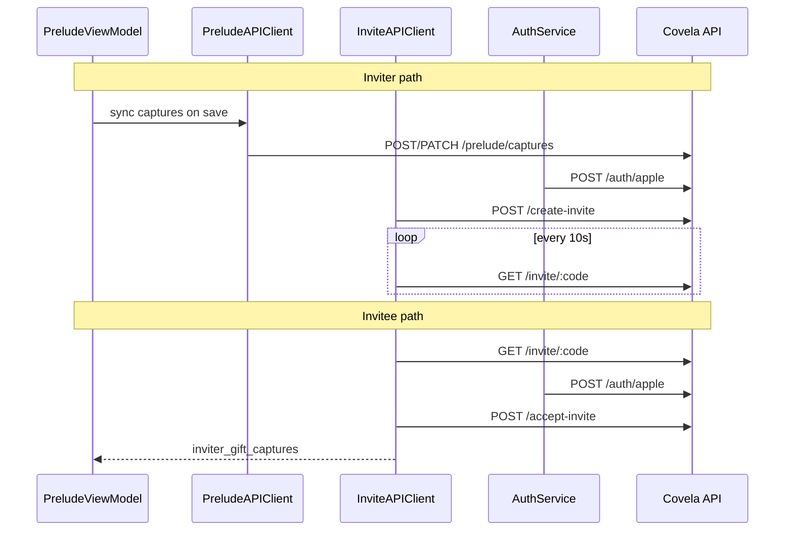

# Partner Invite Backend Integration — iOS App Plan

**Date:** 2026-07-03  
**Status:** Ready to implement  
**Backend:** pocketverse `/covela/api` (live)  
**App:** LoveTrail / BabyTown  

---

## Overview

The Covela backend now exposes invite, prelude, and push-token endpoints under `/covela/api`. The iOS app still uses `StubInviteAPIClient` and stores all prelude captures locally. This plan wires the app to the real backend while keeping existing UI flows (`OnboardingInviteView`, `PendingHomeView`, partner onboarding, gift reveal).

**Out of scope for this plan:**
- `POST /send-invite-email` (deferred — copy/paste code + App Store link)
- MongoDB Change Stream / SSE (backend uses polling MVP; app already polls every 10s)
- Breakup / archive / reconnect APIs

---

## Backend API Reference

Base URL: `CovelaAPIConfig.baseURL` → `https://pocketverse.herokuapp.com/covela/api` (debug)

| Method | Path | Auth | Purpose |
|--------|------|------|---------|
| `POST` | `/auth/apple` | None | Sign in; returns `{ token, userId, isNewUser }` |
| `POST` | `/prelude/captures` | Bearer | Create capture |
| `GET` | `/prelude/captures` | Bearer | List own captures |
| `PATCH` | `/prelude/captures/:id` | Bearer | Update `is_gift_included` |
| `DELETE` | `/prelude/captures/:id` | Bearer | Delete capture |
| `POST` | `/create-invite` | Bearer | Create invite + couple |
| `GET` | `/invite/:code` | Optional Bearer | Validate code / poll status |
| `POST` | `/accept-invite` | Bearer | Pair accounts |
| `POST` | `/device/push-token` | Bearer | Register APNs token |

### Request / response shapes

**POST /create-invite**
```json
// Request
{ "inviter_name": "Justin", "gift_capture_ids": ["507f1f77bcf86cd799439011"] }

// Response 201
{ "code": "X7KP4Q", "link": "https://covela.app/invite/X7KP4Q" }
```

**GET /invite/:code**
```json
// Response 200
{ "valid": true, "inviter_name": "Justin", "status": "pending", "existing_user": false }
```
`status`: `pending` | `accepted` | `expired` | `cancelled`  
When `valid: false`, still returns `status` and `inviter_name` when known.

**POST /accept-invite**
```json
// Request
{ "code": "X7KP4Q" }

// Response 200
{
  "couple_id": "...",
  "inviter_name": "Justin",
  "partner_had_prelude": false,
  "inviter_gift_captures": [
    { "id": "...", "type": "note", "note_text": "...", "is_gift_included": true }
  ],
  "partner_gift_captures": []
}
```

Capture `type` values match app enum: `note`, `first`, `voiceMemo`, `reason`.

**POST /device/push-token**
```json
{ "iosPushToken": "<hex>", "deviceType": "ios" }
```

---

## Current App State

| Component | File | Status |
|-----------|------|--------|
| Invite stub | `BabyTown/Services/InviteAPIClient.swift` | All methods fake |
| Auth + JWT | `BabyTown/Services/AuthService.swift`, `CovelaAPIClient.swift` | Apple sign-in works; no auth headers on other calls |
| Prelude data | `BabyTown/ViewModels/PreludeViewModel.swift` | Local JSON only |
| Inviter UI | `BabyTown/Views/OnboardingInviteView.swift` | Uses stub |
| Inviter poll | `BabyTown/Views/PendingHomeView.swift` | Uses stub; empty captures on accept |
| Push | `BabyTown/AppDelegate.swift` | Local notifications only; no remote token upload |

---

## Architecture



---

## Implementation Phases

### Phase 1 — Authenticated HTTP layer

**Goal:** Reusable Covela API client with Bearer token support.

**Files to modify:**
- `BabyTown/Services/CovelaAPIClient.swift`

**Tasks:**
1. Add generic methods: `get(path:token:)`, `post(path:body:token:)`, `patch(path:body:token:)`, `delete(path:token:)`
2. Read token from `AuthService.shared.authToken` (or pass explicitly)
3. Set `Authorization: Bearer <token>` on authenticated requests
4. Decode `{ error: String }` on non-2xx (reuse existing `CovelaAPIError.server`)
5. Keep existing `signInWithApple` working (unauthenticated POST)

**Acceptance:** Manual test — authenticated GET returns 401 without token, 200 with token.

---

### Phase 2 — Live InviteAPIClient

**Goal:** Replace stub with real network calls.

**Files:**
- Modify: `BabyTown/Services/InviteAPIClient.swift`
- Modify: `BabyTown/Views/OnboardingInviteView.swift`
- Modify: `BabyTown/Views/PendingHomeView.swift`

**Tasks:**

1. **Add `LiveInviteAPIClient`** implementing `InviteAPIClientProtocol`:
   - `createInvite(inviterName:giftCaptureIds:)` → `POST /create-invite`
   - `checkInviteStatus(code:)` → `GET /invite/:code`
   - `acceptInvite(code:)` → `POST /accept-invite`
   - `sendInviteEmail` → no-op or throw "not implemented" (UI already handles email failure)

2. **Update protocol** — extend `createInvite` to accept gift capture server IDs:
   ```swift
   func createInvite(inviterName: String, giftCaptureIds: [String]) async throws -> InviteCreatedResponse
   ```

3. **Map accept response** → `InviteAcceptedResponse`:
   ```swift
   // inviter_gift_captures → [GiftRevealCapture]
   // inviter_name → revealerName
   ```
   Mapping helper:
   | Backend field | GiftRevealCapture |
   |---------------|-------------------|
   | `id` | `UUID(uuidString:)` or generate stable UUID from server id string |
   | `type` | `PreludeCapture.CaptureType` |
   | `note_text` / `reason_text` / `first_label` | `displayText` |
   | `type` | `typeIcon` via existing PreludeCapture logic |

4. **Dependency injection** — add shared accessor:
   ```swift
   enum InviteAPI {
     static var client: InviteAPIClientProtocol = LiveInviteAPIClient()
     // DEBUG: allow StubInviteAPIClient via env flag if needed
   }
   ```

5. **Swap call sites** — replace `StubInviteAPIClient.shared` in both views.

6. **Inviter poll on accept** — when `status == .accepted`:
   - Call `PreludeViewModel.transitionToOfficial()` (or equivalent profile update)
   - Navigate via existing `onPartnerJoined` (inviter sees partner name; empty captures is OK)

**Acceptance:**
- Inviter sends invite → receives real 6-char code
- Invitee enters code → pairs successfully
- Inviter poll detects `accepted` within ~10s

---

### Phase 3 — Prelude capture sync

**Goal:** Server has captures before `create-invite` so `gift_capture_ids` are valid.

**Files to create:**
- `BabyTown/Services/PreludeAPIClient.swift`

**Files to modify:**
- `BabyTown/Models/PreludeCapture.swift` — add optional `serverId: String?`
- `BabyTown/ViewModels/PreludeViewModel.swift` — sync on CRUD
- `BabyTown/Views/OnboardingInviteView.swift` — pass server IDs to `createInvite`
- `BabyTown/Services/DataPersistenceManager.swift` — persist `serverId` with captures

**Tasks:**

1. **PreludeAPIClient** methods:
   - `createCapture(_ capture: PreludeCapture) async throws -> String` (returns server id)
   - `updateGiftInclusion(serverId:isIncluded:)` → PATCH
   - `deleteCapture(serverId:)` → DELETE
   - `syncAllCaptures(_ captures: [PreludeCapture]) async throws -> [PreludeCapture]` — bulk upsert before invite

2. **Field mapping** (app → backend):

   | App | Backend body key |
   |-----|------------------|
   | `type.rawValue` | `capture_type` |
   | `noteText` | `text` |
   | `noteMood` | `mood` |
   | `firstLabel` | `first_label` / `milestoneLabel` |
   | `firstDate` | `milestoneDate` |
   | `reasonText` | `reason_text` |
   | `isIncludedInGift` | `is_gift_included` |
   | `voiceMemoPath` (after upload) | `voice_memo_url` |
   | photo S3 key (after upload) | `photo_path` |

3. **Media upload** — voice memos and photos are local files today. Options (pick one):
   - **MVP:** Sync text-only captures first; defer photo/voice upload to a follow-up
   - **Full:** Upload media to S3 (or GridFS) before capture POST; store returned URL in capture

4. **Sync strategy** (recommended for MVP):
   - On `addCapture` / `updateCapture` / `toggleGiftInclusion` / `deleteCapture`: fire-and-forget async sync if signed in
   - Before `create-invite`: call `syncAllCaptures` to ensure all gift captures have `serverId`
   - Pass `viewModel.giftCaptures.compactMap(\.serverId)` to `createInvite`

5. **Offline / unsigned-in:** Keep local-only behavior; block invite send with "Sign in required" if no token.

**Acceptance:**
- Gift capture appears in accept-invite response for invitee
- Non-gift captures never appear in response (backend enforces; verify in UI)

---

### Phase 4 — Auth gating

**Goal:** JWT present before any invite or prelude API call.

**Files to modify:**
- `BabyTown/Views/Prelude/GiftCurationView.swift` / `AccountSetupFlow.swift`
- `BabyTown/Views/OnboardingInviteView.swift`
- `BabyTown/Views/Prelude/PartnerOnboardingFlow.swift`

**Tasks:**

1. **Inviter:** Before `POST /create-invite`, ensure user completed Apple Sign In (`AuthService.isSignedIn`). If not, present auth sheet or route to `.auth`.

2. **Invitee:** Before `POST /accept-invite`, require sign-in. Partner onboarding should call Apple Sign In before "Open our space" / "Join".

3. **Validate code early:** On code entry or deep link, call `GET /invite/:code`:
   - If `valid == false` → show error
   - If `existing_user == true` → skip identity steps in partner flow
   - Store `inviter_name` for gift reveal header

**Acceptance:** Unauthenticated create/accept returns user-friendly error, not silent failure.

---

### Phase 5 — Push token registration

**Goal:** Inviter receives APNs when partner accepts.

**Files to modify:**
- `BabyTown/AppDelegate.swift`
- `BabyTown/Services/AuthService.swift` (or new `DeviceAPIClient.swift`)

**Tasks:**

1. After notification permission granted, call `UIApplication.shared.registerForRemoteNotifications()`

2. Implement `application(_:didRegisterForRemoteNotificationsWithDeviceToken:)`:
   - Convert token to hex string
   - POST `/device/push-token` when `AuthService.isSignedIn`

3. Re-register token after each successful Apple sign-in

4. Handle `invite_accepted` in `userNotificationCenter(_:didReceive:)`:
   - Read `coupleProfileId` from payload
   - Trigger poll / transition to official (same as poll success path)

**Acceptance:** Inviter with token registered receives push when partner accepts (requires `COVELA_APNS_*` env on server).

---

### Phase 6 — Polish and edge cases

**Tasks:**

1. **Resend invite** — UI already creates new invite; backend cancels prior pending invite automatically.

2. **Copy/paste share sheet** — Show `code` + App Store link (not backend `link` alone if you prefer manual message):
   ```
   Join me in Covela — code: X7KP4Q
   Download: <App Store URL>
   ```

3. **Error messages** — Map backend errors:
   | HTTP / error | User message |
   |--------------|--------------|
   | 400 "Cannot accept your own invite" | "You can't use your own code." |
   | 400 "Invite is expired" | "That code has expired." |
   | 409 "Already in an official couple" | "You're already paired." |
   | 401 | "Please sign in again." |

4. **Loading states** — Keep existing `isLoading` spinners on send/join buttons.

5. **Remove or gate stub** — `#if DEBUG` flag `USE_STUB_INVITE_API` for offline UI work.

---

## File Checklist

| Action | Path |
|--------|------|
| Modify | `BabyTown/Services/CovelaAPIClient.swift` |
| Modify | `BabyTown/Services/InviteAPIClient.swift` |
| Create | `BabyTown/Services/PreludeAPIClient.swift` |
| Create | `BabyTown/Services/DeviceAPIClient.swift` (optional) |
| Modify | `BabyTown/Models/PreludeCapture.swift` |
| Modify | `BabyTown/ViewModels/PreludeViewModel.swift` |
| Modify | `BabyTown/Services/DataPersistenceManager.swift` |
| Modify | `BabyTown/Views/OnboardingInviteView.swift` |
| Modify | `BabyTown/Views/PendingHomeView.swift` |
| Modify | `BabyTown/Views/Prelude/PartnerOnboardingFlow.swift` |
| Modify | `BabyTown/AppDelegate.swift` |
| Modify | `BabyTown/Services/AuthService.swift` |

---

## Suggested Implementation Order

| Step | Phase | Why |
|------|-------|-----|
| 1 | Phase 1 | Foundation for all authenticated calls |
| 2 | Phase 2 | End-to-end pairing without gifts |
| 3 | Phase 4 | Prevent 401s in real usage |
| 4 | Phase 3 | Gift reveal shows real content |
| 5 | Phase 5 | Push notification to inviter |
| 6 | Phase 6 | UX polish |

---

## Test Plan

### Manual — two devices or simulator + physical

**Inviter (Device A):**
1. Sign in with Apple
2. Create prelude captures; mark some as gift
3. Send invite → copy code
4. Land on pending home; wait for accept

**Invitee (Device B):**
1. Enter code → validate
2. Sign in with Apple
3. Accept invite → see gift reveal

**Inviter (Device A):**
4. Poll detects accepted OR push received
5. Transitions to official home

### Unit tests (optional)

- JSON decoding for invite responses
- `GiftRevealCapture` mapping from sample backend JSON
- Invite code validation (6 chars, allowed alphabet)

### Debug config

Xcode scheme env var:
```
COVELA_API_BASE_URL = http://localhost:3000/covela/api
```
(for local pocketverse server)

---

## Dependencies on Backend

Confirm deployed pocketverse has:
- `MONGO_URI_COVELA` connected
- `COVELA_JWT_KEY` (or shared `JWT_KEY`)
- `COVELA_APPLE_*` for Sign in with Apple
- `COVELA_APNS_*` for push (optional until Phase 5)

---

## Reference Docs

- Backend spec: `LoveTrail/docs/superpowers/specs/2026-06-22-partner-invite-pairing-backend-design.md`
- Existing UI plan: `LoveTrail/docs/superpowers/plans/2026-06-23-invite-partner-official-onboarding.md`
- Backend implementation: pocketverse `src/server/covela/`
